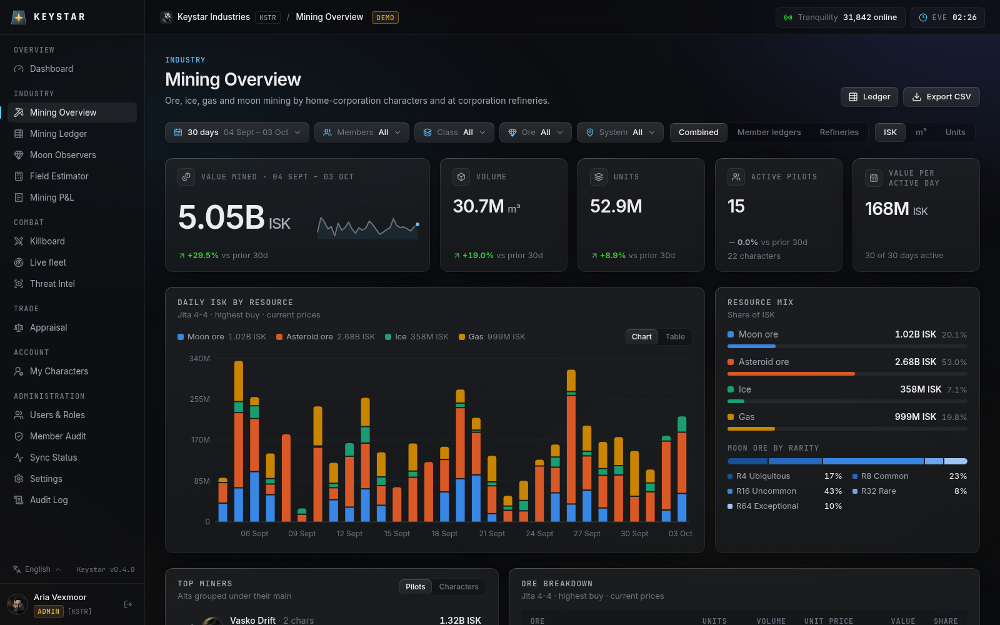
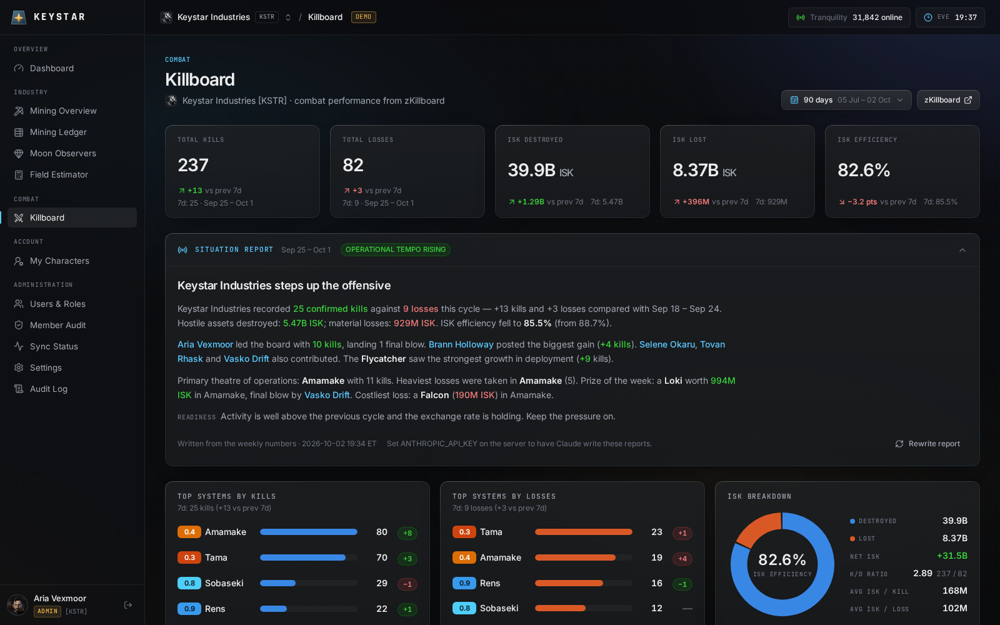
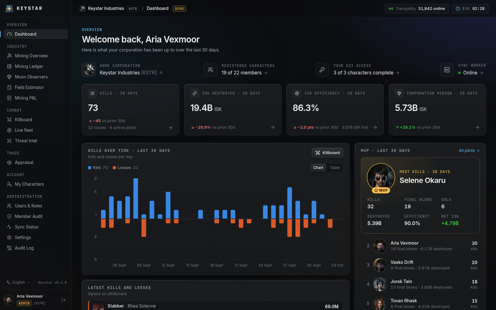
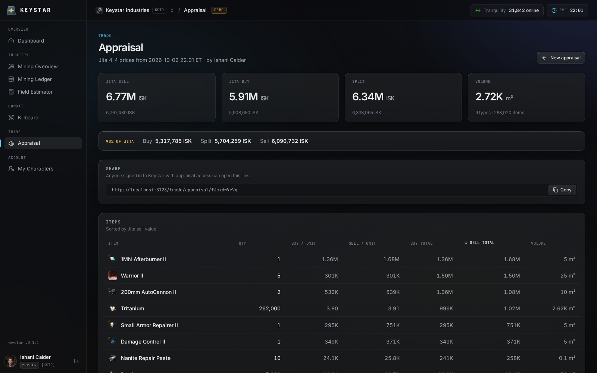
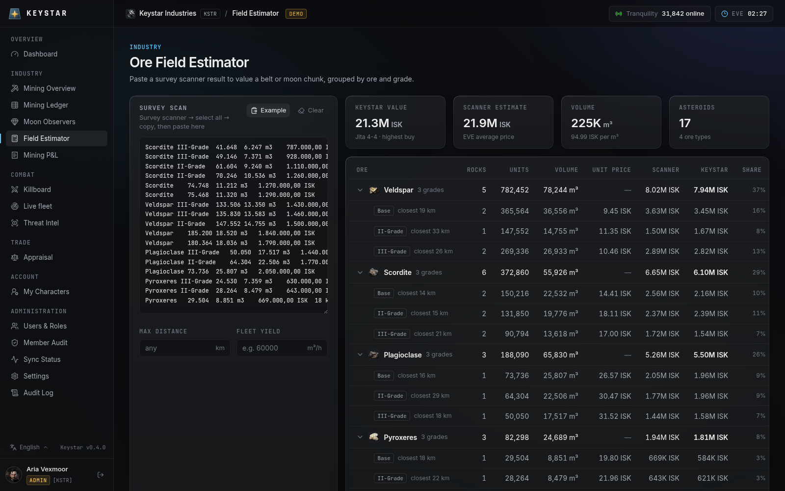
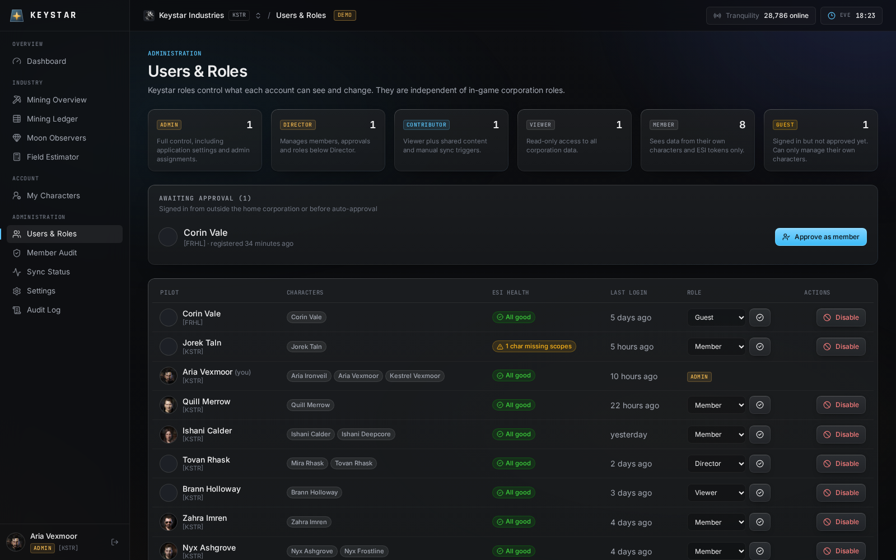

<p align="center">
  
</p>

<h1 align="center">Keystar</h1>

<p align="center">
  A self-hosted EVE Online corporation dashboard built on ESI — inspired by SeAT and Pathfinder,
  designed for small and alt corporations.
</p>

---

Keystar signs pilots in with **EVE SSO**, collects their **ESI tokens** with exactly the scopes its modules need,
syncs data in the background and turns it into dashboards. Modules so far: **mining** (personal and moon-refinery
ledgers with filters, daily volume / value / quantity, member and ore breakdowns, CSV export and an ore field
estimator for survey scans), a **killboard** with the corporation's PvP performance from zKillboard and a weekly
situation report, and an **appraisal** tool for Jita prices.





<table>
  <tr>
    <td></td>
    <td></td>
  </tr>
  <tr>
    <td></td>
    <td></td>
  </tr>
</table>

<sub>Screenshots use the built-in demo data (`pnpm demo:seed`).</sub>

## Features

- **EVE SSO login** (OAuth 2.0 + PKCE, JWT validated against CCP's keys), multiple characters per account,
  automatic handling of character transfers.
- **ESI token management** — encrypted refresh tokens (AES-256-GCM), per-character scope status, re-authorisation,
  token revocation on removal, and a shareable `/join` link that explains every requested scope to members.
- **Roles inside Keystar**: Admin › Director › Contributor › Viewer › Member › Guest. Directors approve guests and
  manage roles below their own; admins can tune the minimum role of every permission.
- **Mining**
  - Personal ledgers *and* corporation moon-observer ledgers, de-duplicated in a combined view
  - Filters for date range, members, ore class, ore type, system and data source — all in the URL
  - Daily stacked chart (ISK / m³ / units), resource mix with moon rarity, top miners (grouped by main or per
    character), ore and system breakdowns, data-coverage panel
  - Valuation by Jita 4-4 buy / sell / split or ESI average, at current or historical prices
  - Full ledger with pagination and CSV export
  - **Ore field estimator**: paste a survey scanner result (German or English client) and get the field's value by
    ore and grade, with distance filter and time-to-clear
  - **Mining P&L** for pilots mining with alts: ore income valued like the dashboard (with a buyback % and per-ore
    prices), mining costs from opt-in wallet imports (crystals, Heavy Water, burst charges, drones, hulls — suggested
    until you include them) plus manual costs, net profit per day / week / month, ISK per hour from measured ledger
    activity, cost per m³, per-character and per-activity splits. Only you see your sheet.
- **Killboard** for the home corporation from zKillboard (no extra scopes): kills, losses, ISK efficiency with
  week-over-week changes, a weekly **situation report** written by Claude (optional API key) or from a template, top
  systems, recent activity, most effective / used / lost ships and pilot efficiency.
- **Live fleet**: the fleet boss shares their fleet from ESI; members by wing and squad with ship, system and role,
  composition by ship class, joins and leaves, refreshed every 15 seconds, plus a list of past fleets.
- **Threat intel** (Combat): paste local, a fleet composition or names (plus an optional d-scan) and see who they
  are, whether they fought your corporation and what they brought, and how dangerous each pilot is *right now*:
  explained scores weighted toward recent kills, the latest kills and losses per pilot, role tags (cyno, hunter,
  tackle, capital …), who flies together, standings from your contacts, and a briefing, pilot dossiers and d-scan
  reads written by Claude (optional API key) or from templates. Scans are shareable and feed a corp-wide
  "recently seen hostiles" list.
- **Appraisal** (Trade): paste cargo, inventory, contracts, EFT fittings, d-scans, killmails or item lists and get
  Jita 4-4 buy / sell / split values, volume and a percentage price (e.g. for buyback), saved as a shareable link.
- **Administration**: users & roles, member audit (in-game roster vs registered), sync status with manual triggers,
  settings, audit log, and a short first-start setup walkthrough.
- **Background worker** respecting ESI's 2025+ rules: `X-Compatibility-Date`, ETag/Expires caching, pagination,
  error-limit and per-group rate-limit back-off.
- **English and German**: the language follows the browser (English for everything else) and can be switched in the
  sidebar footer; numbers and dates use the language's conventions (e.g. "9,87 Mio. ISK").
- **Design**: dark, EVE-flavoured UI.

See [ROADMAP.md](ROADMAP.md) for what's next (skills, assets, wallets).

## Deploy

Keystar runs anywhere Docker runs. The supported path is a small Linux VPS with Docker Compose (Postgres, app,
worker and Caddy with automatic HTTPS):

```bash
git clone https://github.com/theragus/keystar.git && cd keystar
cp .env.example .env    # set domain, secrets and your EVE application credentials
docker compose pull     # released image from ghcr.io/theragus/keystar
docker compose up -d
```

**→ Full step-by-step guide for Ubuntu 24.04 / 26.04: [docs/deployment.md](docs/deployment.md)**

Releases and their changes: [releases](https://github.com/theragus/keystar/releases) · [CHANGELOG.md](CHANGELOG.md) ·
how releases are cut: [docs/releasing.md](docs/releasing.md).

## Develop

Requirements: Node.js 22+, pnpm 10, PostgreSQL 16+.

```bash
pnpm install
cp .env.example .env          # set DATABASE_URL, APP_SECRET, APP_URL=http://localhost:3000
pnpm db:migrate
pnpm dev                      # web app on http://localhost:3000
pnpm dev:worker               # background sync worker (second terminal)
```

Try it without EVE credentials using demo data (fake corporation, every role, ~120 days of mining):

```bash
KEYSTAR_DEMO_MODE=true pnpm demo:seed
KEYSTAR_DEMO_MODE=true pnpm dev
```

| Command              | Purpose                                                        |
| -------------------- | -------------------------------------------------------------- |
| `pnpm test`          | Unit tests (+ integration tests when `TEST_DATABASE_URL` is set) |
| `pnpm lint`          | ESLint                                                         |
| `pnpm typecheck`     | TypeScript                                                     |
| `pnpm db:generate`   | Create a migration after changing a Drizzle schema             |
| `pnpm build`         | Production build (Next.js standalone + bundled worker)         |

## Documentation

- [docs/deployment.md](docs/deployment.md) — VPS setup, backups, updates, troubleshooting
- [docs/architecture.md](docs/architecture.md) — how the pieces fit together
- [docs/modules.md](docs/modules.md) — adding a feature module (skills, assets, …)
- [ROADMAP.md](ROADMAP.md) — planned features

## Tech stack

Next.js 16 (App Router) · React 19 · TypeScript · Tailwind CSS 4 · PostgreSQL + Drizzle ORM · jose · Recharts ·
Vitest · Docker Compose + Caddy.

## License

Keystar is free software, licensed under the [GNU Affero General Public License v3.0 or later](LICENSE). You may use,
modify and share it; if you run a modified version as a service for other people, you must offer them its source code
(set `SOURCE_URL` to your fork — the login page links to it).

---

EVE Online and the EVE logo are the registered trademarks of CCP hf. All rights are reserved worldwide. Keystar is a
fan-made tool and is not affiliated with or endorsed by CCP hf.
